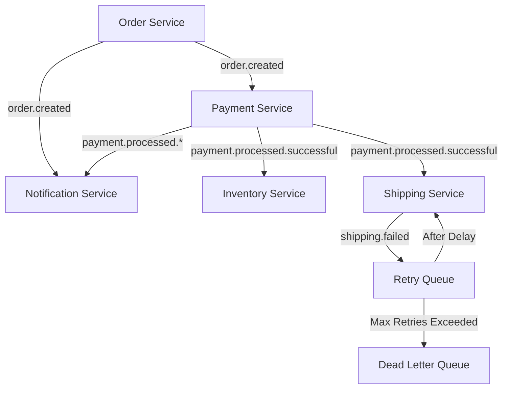

<p align="center">
  <a href="http://nestjs.com/" target="blank"></a>
</p>

[circleci-image]: https://img.shields.io/circleci/build/github/nestjs/nest/master?token=abc123def456
[circleci-url]: https://circleci.com/gh/nestjs/nest

  <p align="center">A progressive <a href="http://nodejs.org" target="_blank">Node.js</a> framework for building efficient and scalable server-side applications.</p>
    <p align="center">
<a href="https://www.npmjs.com/~nestjscore" target="_blank"></a>
<a href="https://www.npmjs.com/~nestjscore" target="_blank"></a>
<a href="https://www.npmjs.com/~nestjscore" target="_blank"></a>
<a href="https://circleci.com/gh/nestjs/nest" target="_blank"></a>
<a href="https://discord.gg/G7Qnnhy" target="_blank"></a>
<a href="https://opencollective.com/nest#backer" target="_blank"></a>
<a href="https://opencollective.com/nest#sponsor" target="_blank"></a>
  <a href="https://paypal.me/kamilmysliwiec" target="_blank"></a>
    <a href="https://opencollective.com/nest#sponsor"  target="_blank"></a>
  <a href="https://twitter.com/nestframework" target="_blank"></a>
</p>
  <!--[](https://opencollective.com/nest#backer)
  [](https://opencollective.com/nest#sponsor)-->

## Description

[Nest](https://github.com/nestjs/nest) framework TypeScript starter repository.

## Project setup

```bash
$ npm install
```

## Compile and run the project

```bash
# development
$ npm run start

# watch mode
$ npm run start:dev

# production mode
$ npm run start:prod
```

## Run tests

```bash
# unit tests
$ npm run test

# e2e tests
$ npm run test:e2e

# test coverage
$ npm run test:cov
```

## Deployment

When you're ready to deploy your NestJS application to production, there are some key steps you can take to ensure it runs as efficiently as possible. Check out the [deployment documentation](https://docs.nestjs.com/deployment) for more information.

If you are looking for a cloud-based platform to deploy your NestJS application, check out [Mau](https://mau.nestjs.com), our official platform for deploying NestJS applications on AWS. Mau makes deployment straightforward and fast, requiring just a few simple steps:

```bash
$ npm install -g @nestjs/mau
$ mau deploy
```

With Mau, you can deploy your application in just a few clicks, allowing you to focus on building features rather than managing infrastructure.

## Resources

Check out a few resources that may come in handy when working with NestJS:

- Visit the [NestJS Documentation](https://docs.nestjs.com) to learn more about the framework.
- For questions and support, please visit our [Discord channel](https://discord.gg/G7Qnnhy).
- To dive deeper and get more hands-on experience, check out our official video [courses](https://courses.nestjs.com/).
- Deploy your application to AWS with the help of [NestJS Mau](https://mau.nestjs.com) in just a few clicks.
- Visualize your application graph and interact with the NestJS application in real-time using [NestJS Devtools](https://devtools.nestjs.com).
- Need help with your project (part-time to full-time)? Check out our official [enterprise support](https://enterprise.nestjs.com).
- To stay in the loop and get updates, follow us on [X](https://x.com/nestframework) and [LinkedIn](https://linkedin.com/company/nestjs).
- Looking for a job, or have a job to offer? Check out our official [Jobs board](https://jobs.nestjs.com).

## Support

Nest is an MIT-licensed open source project. It can grow thanks to the sponsors and support by the amazing backers. If you'd like to join them, please [read more here](https://docs.nestjs.com/support).

## Stay in touch

- Author - [Kamil Myśliwiec](https://twitter.com/kammysliwiec)
- Website - [https://nestjs.com](https://nestjs.com/)
- Twitter - [@nestframework](https://twitter.com/nestframework)

## License

Nest is [MIT licensed](https://github.com/nestjs/nest/blob/master/LICENSE).

# E-commerce Flow Demo with RabbitMQ

A microservices-based e-commerce system demonstration using NestJS and RabbitMQ, showcasing event-driven architecture with retry mechanisms and dead letter queues.

## System Architecture

The system consists of the following microservices:

1. **Order Service**: Handles order creation and initiates the order processing flow
2. **Payment Service**: Processes payments for created orders
3. **Inventory Service**: Updates stock levels after successful payment
4. **Shipping Service**: Manages shipment creation with retry mechanism
5. **Notification Service**: Sends notifications for order and payment events

## Message Flow



## RabbitMQ Setup

The system uses the following RabbitMQ components:

- **Exchange**: `ecommerce.events` (topic)
- **Queues**:
  - `notification.service.order.created`
  - `payment.service.order.created`
  - `inventory.service.payment.successful`
  - `shipping.service.queue`
  - `shipping.service.retry.queue`
  - `shipping.service.final.dlq`

## Prerequisites

- Node.js (Latest LTS version)
- RabbitMQ Server running locally on port 5672
- npm or yarn package manager

## Project Setup

1. Install dependencies:
```bash
npm install
```

2. Ensure RabbitMQ is running locally:
```bash
# Windows (if installed as a service)
net start RabbitMQ

# Linux/MacOS
brew services start rabbitmq  # for MacOS with Homebrew
systemctl start rabbitmq-server  # for Linux
```

## Running the Application

1. Start the application in development mode:
```bash
npm run start:dev
```

2. The application will:
   - Set up all required RabbitMQ exchanges and queues
   - Start all microservices
   - Listen on port 3000 for HTTP requests

## Testing the Flow

1. Create a new order by sending a POST request to `/orders`:
```bash
curl -X POST http://localhost:3000/orders -H "Content-Type: application/json" -d '{
  "customerId": "CUST123",
  "customerEmail": "customer@example.com",
  "items": [
    {
      "productId": "PROD123",
      "quantity": 1,
      "price": 29.99
    }
  ],
  "totalAmount": 29.99
}'
```

2. The system will:
   - Generate a unique orderId and correlationId
   - Publish an order.created event
   - Process the payment
   - Update inventory
   - Create shipment (with retry mechanism if needed)
   - Send notifications at each step

## Error Handling and Retries

The shipping service includes a sophisticated retry mechanism:
- Failed shipments are sent to a retry queue with a delay
- After the delay, messages are reprocessed
- After maximum retries, messages go to a Dead Letter Queue (DLQ)

## Development

```bash
# Run tests
npm run test

# Run e2e tests
npm run test:e2e

# Generate test coverage
npm run test:cov
```

## Monitoring

Monitor the flow through the logs, which include:
- Correlation IDs for request tracing
- Event publishing and consumption details
- Service processing status
- Retry attempts for failed operations

## License

This project is MIT licensed.
#
